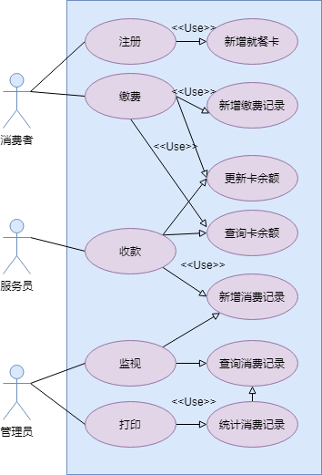
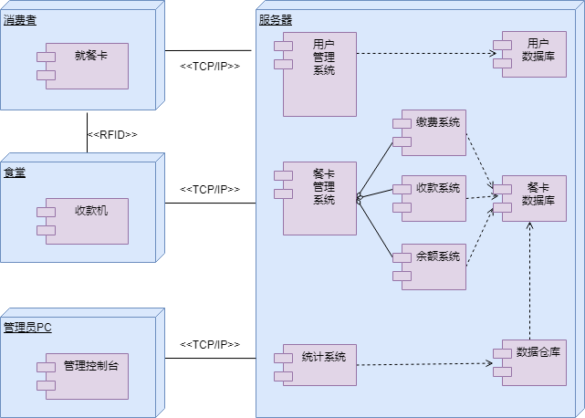
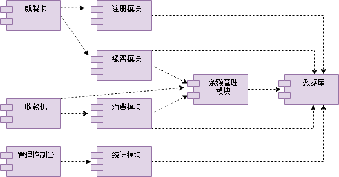
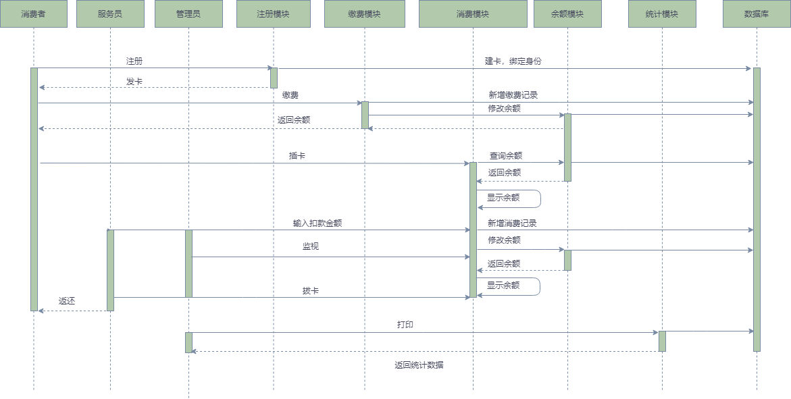

# 食堂就餐卡系统设计

* 系统中每个消费者都有一张卡，在管理中心注册缴费，卡内记着消费者的身份、余额。
* 使用时将卡插入收款机则显示卡上金额，服务员按收款机上数字键，收款机自动计算并显示消费额及余额。
* 管理中心的管理员监视每一笔消费，可打印出消费情况的相关统计数据。

# 系统用例模型

> * 系统的执行者：消费者、服务员、管理员
> * 系统用例：注册管理、缴费管理、消费管理、监控统计

用例图如下，从宏观上描述系统执行者与用例之间的关系：

# 部署图

如下，通过物理拓扑结构来描述系统最终呈现情况：

# 组件图

如下，描述了各个组件间的依赖关系：

# 组件时序图

如下，通过具有时间顺序的消息传递行为，描述各个子模块间的交互：

