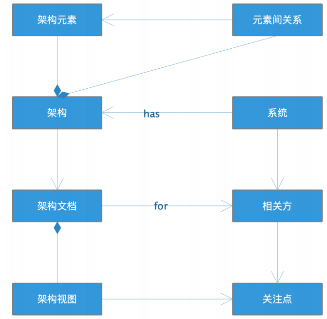
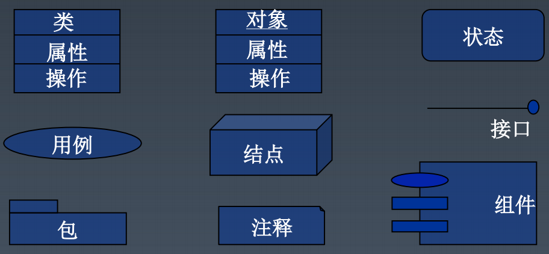
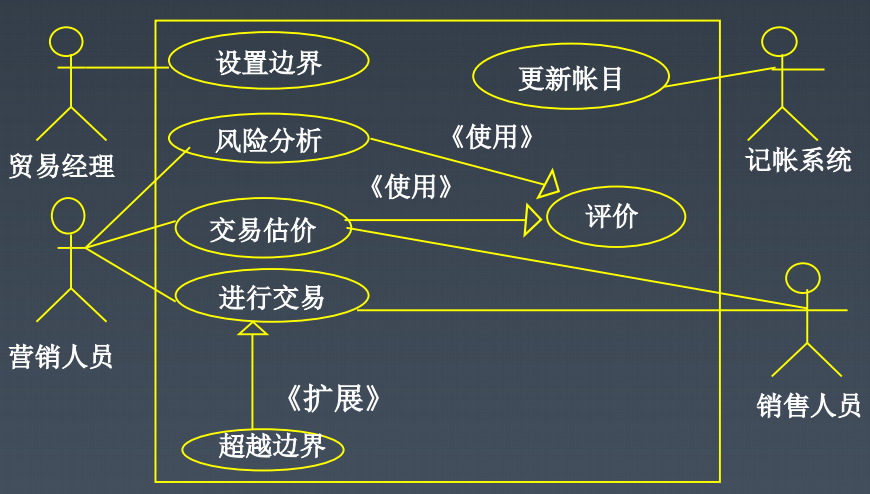
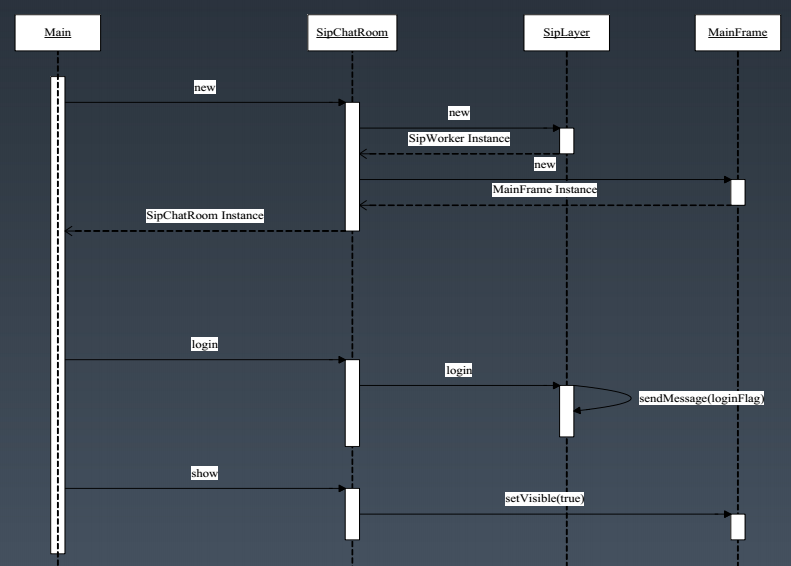
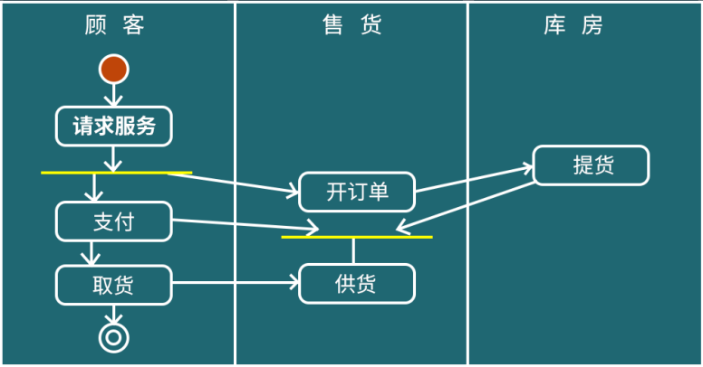
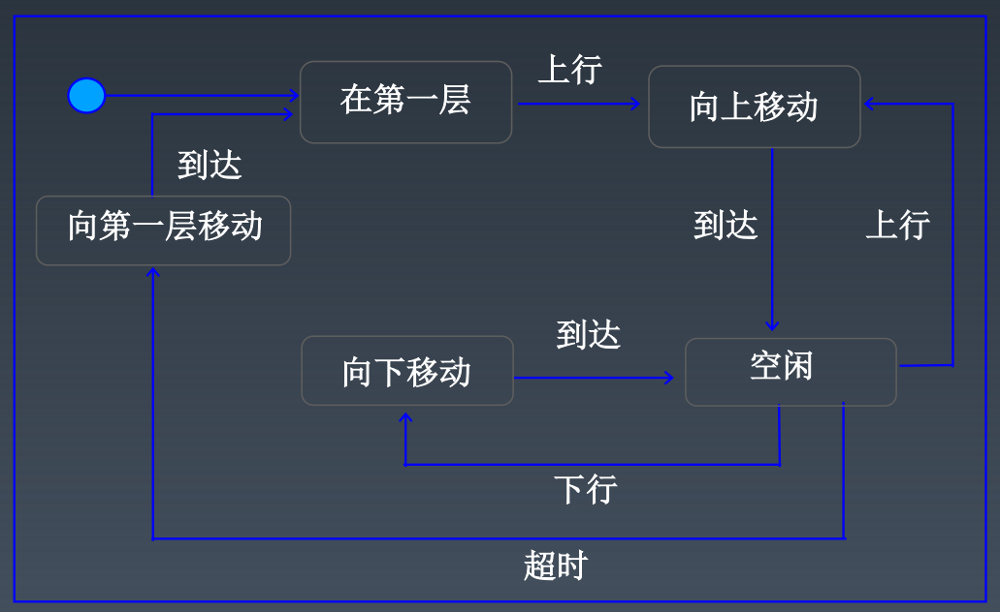
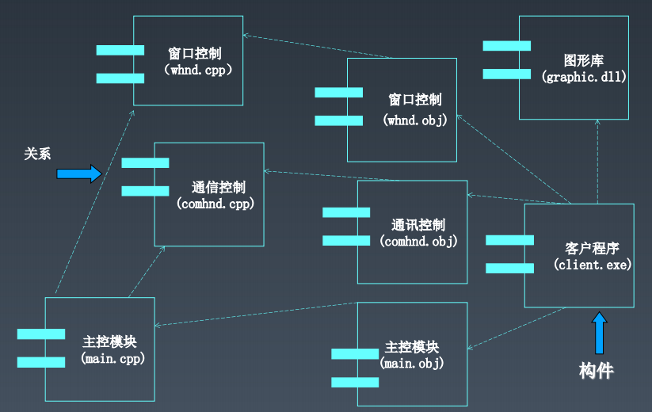
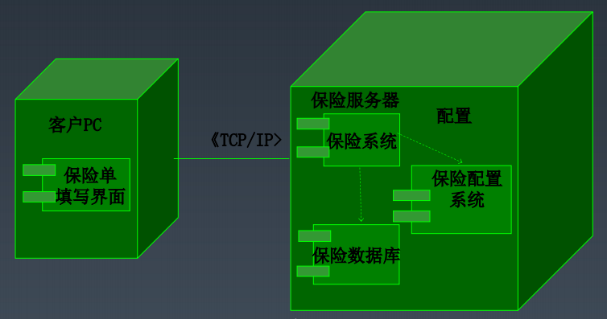

# 1. 大厂架构师招聘JD解读

老师以字节跳动后端架构师的JD，来分析互联网厂商对架构师的典型职责要求

## 职责要求

> * 编写架构设计文档：架构师如何输出自己的架构思想和架构方法
> * 开发编程框架：软件、框架的设计原则
> * 重构软件代码：软件的设计模式，保证软件简单、易复用、易维护
> * 设计系统架构：系统整体架构设计，高可用、高性能、高并发
> * 技术选型：缓存、数据库等具体技术选型，解决技术应用中的问题
> * 优化系统性能：性能测试及性能优化方法
> * 模块分解与微服务架构重构：微服务架构设计，服务设计，模块拆解，领域驱动设计
> * 保障系统安全与高可用：如何保持系统高可用与安全性
> * 大数据应用：大数据平台与框架
> * 技术创新：区块链、机器学习
> * 沟通管理：如何带领团队完成开发

## 其他要求

> * 经验、基本背景

# 2. 架构师面试常见面试题解读

老师以面试中常见的问题，来分析互联网厂商对架构师的典型能力要求

## 能力要求

> * 编程能力
> * 基础技术掌握能力：虚拟机、算法、数据结构、网络等
> * 常用技术产品的理解与应用能力：分布式消息队列、数据库、缓存等
> * 性能优化与分析故障的能力：性能测试方法，性能测试报告解读与优化方法
> * 常用架构模式和框架的理解与应用能力
> * 建模及设计文档的方法和能力：表达自己的设计意图
> * 业务理解与功能模块及非功能模块拆解能力
> * 快速学习能力：发现知识背后的规律，触类旁通
> * 沟通与领导能力：认知事物本质，找到解决途径，通过沟通达成目标

## 什么是架构

有关软件整体结构与组件的抽象描述，用于指导软件系统各个方面的设计。下图展示了软件架构的架构图，架构师向多个利益相关方通过架构文档呈现他们的关注点，获得相关方的支持，得到开发、测试、运维的落地。其中架构文档包含了一些架构视图，通过架构视图来体现各个相关方的关注点。



## 谁是架构师

> * 对整体架构负责的角色
> * 让开发团队协同工作

## 成为架构师

> * 主动承担任务，建立技术影响力
> * 建立知识的深度和广度

# 3. 4+1视图模型：软件开发的本质是什么

可以从多个维度来呈现架构视图，从而完整的表达系统架构

## 逻辑视图

比较常用的有功能模块图

> * 相关方：客户、用户、开发组织管理者
> * 视角：系统的功能元素，以及它们的接口、职责、交互
> * 主要元素：系统、子系统、功能模块、子功能模块、接口
> * 用途：开发组织划分，成本/进度的评估

## 开发视图

比较常用的有类图

> * 相关方：开发相关人员、测试人员
> * 视角：系统如何开发实现
> * 主要元素：描述系统的层、分区、包、框架、系统通用服务、业务通用服务、类和接口、系统平台及相关基础框架
> * 用途：指导开发组织设计和开发实现

## 物理视图

比较常用的有部署图

> * 相关方：系统集成商、系统运维人员
> * 视角：系统逻辑组件到物理节点的物理部署和节点之间的物理网络配置
> * 主要元素：物理节点以及节点的通信
> * 用途：描述系统在物理上的最终呈现

## 过程视图

> * 相关方：性能优化、开发相关人员
> * 视角：系统运行时进程、线程的情况
> * 主要元素：系统进程、线程及处理队列等
> * 用途：了解系统运行过程中的情况

## 场景视图

比较常用的有用例图

> * 相关者：用户、设计和开发人员
> * 视角：概括了架构上最重要的场景（最典型或最有风险）及其非功能性需求，通过这些场景的实现，阐明了架构的广度或众多架构元素运行的方式

## 什么是模型

模型是一个系统的完整的抽象。人们对某个领域特定问题的求解及解决方案，对它们的理解和认识都蕴含在模型中。
通常，开发一个计算机系统是为了解决某个领域特定问题，问题的求解过程，就是从领域问题到计算机系统的映射
```
领域问题==(分析、抽取)==>概念模型==(提取)==>系统需求==(分析、设计)==>解决方案
```

## 建模的目的

> * 为了与他人沟通：告诉他人对领域的认知情况，帮助理解系统的设计
> * 为了保存软件设计的最终成功：系统不断迭代的情况下，始终保持统一性
> * 模型比代码更能表达问题

# 4. UML：软件架构建模的一般方法和工具

## UML

统一建模语言，以图形方式描述软件的概念

## 模型元素

可以在图中使用的概念统一称为模型元素。模型元素在图中用其相应的视图符号表示，下图是常用模型元素



此外还有描述元素与元素之间连接关系的关系元素，常见的关系有：
> * 关联：连接模型元素及链接实例
> * 依赖：表示一个元素以某种方式依赖另一个元素
> * 泛化：表示一般与特殊的关系，即一般元素是特殊元素的泛化
> * 聚合：表示整体与部分的关系


## 用例建模

用于描述系统的功能需求，在宏观上给出模型的总体轮廓。通过对典型用例的分析，使开发者能够有效的了解用户的需求，例如



> * 需求分析阶段的主要产出就是用例模型
> * 用例模型由若干用例图组成，用于描述外部执行者与系统用例（功能）之间的关系
> * 画用例图的过程：确定系统的执行者->确定系统用例->画出顶层用例->分解，画出下层用例

## 类与对象

> * 类图：描述类、接口的静态属性、操作及协作关系
> * 对象图：各个对象交互中某个时刻的状态
> * 包图：高类聚、低耦合的类的集合
> * 用于开发阶段详细设计

## 时序图

描述对象间动态的交互行为，着重体现对象间消息传递的时间顺序。时序图用水平轴表示一组对象，垂直轴表示时间。例如：



## 活动图

描述系统中各种活动执行的顺序，既可用来描述操作（类的方法）的行为，也可以描述用例与对象内部的工作过程，并可用于表示并行过程。例如



## 状态图

描述一个特定对象的所有可能的状态及引起状态转移的事件。状态图包含一系列的状态及状态之间的转移。例如



## 组件图

描述物理、可替换的组件在编译、连接或执行时的依赖关系。例如



## 部署图

描述系统硬件的物理拓扑结构以及在此结构上执行的软件。例如



# 5. 架构设计文档：软件架构设计文档的写作模式

UML加文字说明即构成了架构设计文档

## 设计概述

> * 功能概述：描述系统功能，可用逻辑图表示
> * 非功能约束：描述系统性能、可用性、维护性、安全性、成本

## 系统部署图与整体设计

> * 整体设计：通过部署图描述系统整体形态
> * 不同场景设计：通过序列图、活动图等描述不同场景下子系统交互过程

## 子系统设计

> * 整体设计：通过组件图描述子系统整体形态
> * 不同场景设计：通过序列图、活动图等描述不同场景下组件内部工作过程
> * 开发设计：通过类图、序列图、状态图等描述对象间交互、对象状态转移的过程

# 6. 第一周课后练习

## [作业一：食堂就餐卡系统设计](DiningCardSystem.md)

## 作业二：根据当周学习情况，完成一篇学习总结