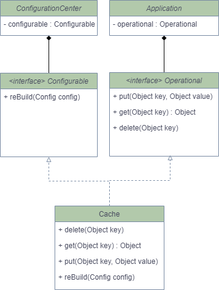

> 请用接口隔离原则优化 Cache 类的设计，画出优化后的类图


```
提示：cache 实现类中有四个方法，其中 put get delete 方法是需要暴露给应用程序的，rebuild 方法是需要暴露给系统进行远程调用的。
如果将 rebuild 暴露给应用程序，应用程序可能会错误调用 rebuild 方法，导致 cache 服务失效。
按照接口隔离原则：不应该强迫客户程序依赖它们不需要的方法。
也就是说，应该使 cache 类实现两个接口，一个接口包含 get put delete 暴露给应用程序，一个接口包含 rebuild 暴露给系统远程调用。
从而实现接口隔离，使应用程序看不到 rebuild 方法
```

